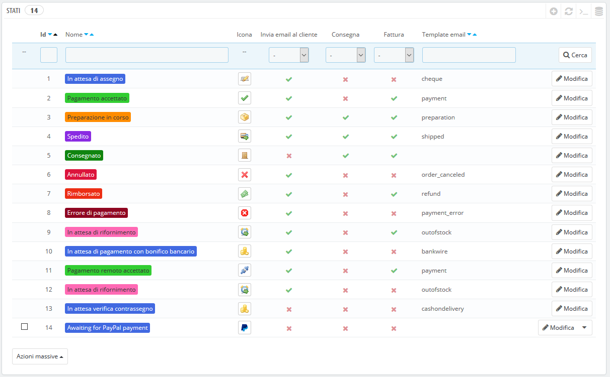

# Stati

Avere a disposizione diversi stati di ordine o di reso ti consente di gestire facilmente gli ordini e le restituzioni, informando i tuoi clienti sull'evoluzione del loro acquisto.

I vari stati disponibili sono visibili e modificabili nella pagina "Statistiche", nel menu "Impostazioni ordine".

La pagina mostra un elenco degli stati dell'ordine registrati, insieme a:

* Colori distintivi: gli stati mostrano colori che aiutano rapidamente a decidere se c'è un problema con l'ordine o se va tutto bene.
* Icone.
* I legami con tre comportamenti PrestaShop \(ce ne sono diversi\):
* * Dovrebbe il cliente ricevere una email quando l'ordine è in questo stato?
  * È questo uno stato di consegna?
  * Questo stato consente al cliente di scaricare e visualizzare una versione PDF della fattura dell'ordine?
* Il nome del modello di posta elettronica: è possibile modificare questi modelli, lingua per lingua, nella pagina "Traduzioni" sotto il menu "Internazionale". Nella sezione "Modifica traduzioni" di quella pagina, scegli "Traduzioni del modello email" nel menu a discesa e quindi clicca sul codice della lingua in cui desideri modificare questi modelli.
* Le icone di azione: "modifica" ed "elimina".

L'elenco degli stati dei riesi presenta meno informazioni poiché si tratta di tag privi di impatto sugli ordini.

## Creare un nuovo stato dell’ordine 

Puoi creare un nuovo stato con il pulsante "Aggiungi stato nuovo ordine" in alto. Si aprirà il form di creazione.

Compila il form:

* **Nome stato**. Rendilo breve e distintivo.
* **Icona**. È possibile utilizzare qualsiasi icona 16x16; ecco ad esempio il set gratuito di icone FamFamFam Silk: [http://www.famfamfam.com/lab/icons/silk/](http://www.famfamfam.com/lab/icons/silk/).
* **Colore**. Dovresti cercare di impostare il colore dello corrispondente ai colori esistenti. Gli usi dei colori predefiniti sono:
* * * Rosso/Arancio: ordini cancellati o rimborsati,
    * Rosso cremisi: errore di pagamento,
    * Blu: ordini ancora in attesa di pagamento,
    * Verde chiaro: ordini pagati,
    * Verde scuro: ordini consegnati,
    * Viola: ordini spediti,
    * Rosa: ordini ordinati.
* Opzioni: 
  * * **Considera questo stato d’ordine come validato**. Se attivato, questo stato contrassegna tutti gli ordini associati come "pagati".
    * **Consenti a un cliente di scaricare e guardare le versioni PDF delle sue fatture.** Se disattivato dovrai inviare ai clienti la fattura.
    * **Nascondi questo status in tutti gli ordini del cliente**. Consente di creare statistiche interne, per te e per il tuo team. I clienti non lo vedranno mai nella pagina di stato degli ordini.
    * **Invia un’email al cliente quando lo stato dell’ordine viene cambiato**. Quando abilitato, viene mostrato un menu a discesa che consente di scegliere quale modello di posta utilizzare.
    * **Allega all’email il PDF della fattura**. Invia una email al cliente con la fattura in PDF allegata.
    * **Allega all’email il PDF della nota di consegna**. Invia una email al cliente con la nota di consegna in PDF allegata.
    * **Segna l’ordine come spedito**. Fai attenzione: una volta che un ordine è impostato su "spedito", non si può più ritornare allo stato precedente.
    * **Segna l’ordine come pagato**. Stessa cosa qui: una volta che un ordine è impostato su "pagato", non si può più ritornare allo stato precedente.
    * **Mostra il PDF di consegna**. Mostra il PDF di consegna.

## Creare un nuovo status reso merce 

È possibile creare uno status reso merce con il pulsante "Aggiungi nuovo status reso merce" in alto. Si aprirà il form di creazione.

Sono disponibili due campi:

* **Nome stato**. Inserisci il nome desiderato.
* **Colore**. Imposta il suo colore.

Infine salva ciò che hai creato. 

