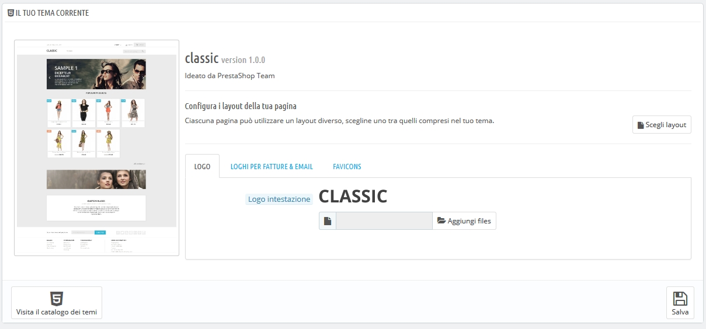
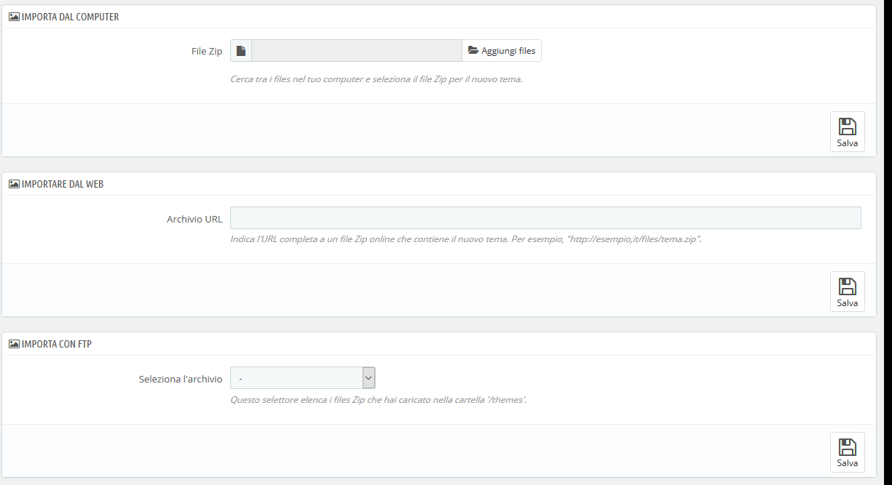

# Tema e Logo

Il suo titolo dice tutto: la pagina "Tema & Logo" ti consente di gestire in modo efficiente i tuoi temi e aggiornare il tuo logo.&#x20;

* [Il tuo tema corrente](tema-e-logo.md#TemaeLogo-Iltuotemacorrente)
  * [Configura i layout della pagina](tema-e-logo.md#TemaeLogo-Configurailayoutdellapagina)
* [Seleziona una tema il tuo negozio "\[mio negozio\]" ](tema-e-logo.md#TemaeLogo-Selezionaunatemailtuonegozio%22\[mionegozio]%22)
* [Aggiungere un tema](tema-e-logo.md#TemaeLogo-Aggiungereuntema)
* [Esportare un tema](tema-e-logo.md#TemaeLogo-Esportareuntema)
* [Live da PrestaShop Addons!](tema-e-logo.md#TemaeLogo-LivedaPrestaShopAddons!)
* [Tema Principale/Secondario](tema-e-logo.md#TemaeLogo-TemaPrincipale/Secondario)
  * [Creare un tema secondario](tema-e-logo.md#TemaeLogo-Creareuntemasecondario)

## Il tuo tema corrente 

La prima sezione della pagina serve come promemoria di quale tema utilizzi attualmente, con i relativi dettagli:

* Nome e versione del tema.
* Nome dell'autore del tema.
* Miniatura del tema.

Questa sezione ti consente inoltre di accedere a una serie di strumenti che ti aiuteranno a personalizzare rapidamente il tema attuale: il logo dell’intestazione, il logo della posta elettronica, il logo della fattura, l’icona preferita, l'icona del negozio e anche processo di navigazione può essere facilmente modificato da qui.

### **Configura i layout della pagina** 

A seconda delle opzioni del tuo tema è possibile personalizzare ogni tipo di layout di pagina: se deve avere colonne o meno, quante, con dimensioni diverse e così via.

Cliccando su "Scegli layout", vedrai una nuova pagina che elenca tutti i tipi di pagine disponibili sul tuo sito (categoria, prodotto, carrello, ...). Per ogni pagina, è possibile modificare il layout predefinito.

Per il tema PrestaShop predefinito, "Classic", le opzioni disponibili sono:

* Larghezza totale - Nessuna colonna laterale, ideale per pagine prive di distrazione, come le pagine dei prodotti.
* Tre colonne - Una grande colonna centrale e due colonne laterali.
* Due colonne, piccola colonna a sinistra - Due colonne con una piccola colonna a sinistra.
* Due colonne, piccola colonna a destra - Due colonne con una piccola colonna a destra.

Clicca su "Salva" per mantenere le modifiche.

Nel caso in cui desideri ripristinare le modifiche e tornare alle impostazioni predefinite, clicca sul pulsante "Rimposta predefinito" nella pagina "Tema & Logo".

**Logo**&#x20;

Cambiare il logo del negozio è spesso uno dei primi passi per personalizzare il proprio negozio. Puoi cambiare il logo principale del tuo negozio, ma non solo, grazie a queste tre diverse schede puoi cambiare:

* **Logo dell'intestazione (header).** Il logo che apparirà su tutte le pagine del tuo negozio.
* **Loghi fattura ed email**. I loghi che verranno rispettivamente visualizzati nelle notifiche email del tuo negozio e nelle relative fatture.
* **Icone**. Icone preferite del tuo negozio (favicon). È la piccola immagine mostrata alla sinistra della barra degli indirizzi del browser web e nelle schede del browser.

Il tema predefinito utilizza un logo "Classic" e il logo di PrestaShop come icona preferita (favicon). Si raccomanda vivamente di cambiare questi loghi per utilizzare il tuo!

In modalità multinegozio è possibile applicare queste modifiche a tutti i tuoi negozi o a un gruppo di negozi contemporaneamente utilizzando il menu multinegozio.ubito sotto la sezione del logo, sulla destra, "Visita il catalogo dei temi" si apre una nuova pagina sul marketplace PrestaShop Addons, dove è possibile trovare ulteriori temi.

\
Subito sotto la sezione del logo, sulla destra, "Visita il catalogo dei temi" si apre una nuova pagina sul marketplace PrestaShop Addons, dove è possibile trovare ulteriori temi.

## Seleziona una tema il tuo negozio "\[mio negozio]"  

Questa sezione viene mostrata solo se sono stati installati almeno due temi. Ti presenta gli altri temi disponibili sull'installazione di PrestaShop accanto a quello già abilitato.

Questa sezione mostra semplicemente le miniature dei temi disponibili, con i loro nomi.

Sposta il cursore del mouse sulla miniatura per visualizzare il menu con due opzioni:

* **Utilizza questo tema**. Il tuo tema attuale verrà sostituito da questo tema.
* **Elimina questo tema**. Eliminerà i file di questo tema dal tuo server web.

In modalità multinegozio non è possibile applicare un tema a tutti i tuoi negozi o a un gruppo di negozi; è necessario selezionare un singolo negozio nel menu multinegozio, quindi scegliere un tema.

## Aggiungere un tema 

È possibile importare un tema e installarlo (con i relativi moduli collegati) grazie al pulsante "Aggiungi nuovo tema". Cliccando su di esso si aprirà una nuova schermata.

Questa schermata presenta 3 metodi per installare un nuovo tema. Un pulsante finale ti porta al form di creazione del tema, presentato nella sezione successiva.

Qualunque sia il metodo, il processo rimane lo stesso: indica la posizione dell'archivio Zip del tema, quindi clicca su "Salva". L'unica cosa che cambia è la fonte del file Zip:

* **Importa dal computer**. Utilizza l'esploratore di file per trovare l'archivio.
* **Importa dal web**. Indica l'URL pubblico diretto all'archivio.
* **Importa da FTP**. Utilizzando il tuo client FTP, carica l'archivio nella seguente cartella: `/themes/`.

Clicca su "Salva" per convalidare la tua scelta: il tema ora è installato.

Clicca su "Salva" un'ultima volta. Una pagina di conferma finale presenta tutte le modifiche apportate all'installazione di PrestaShop. Clicca quindi su "Fine" per terminare il processo.

## Esportare un tema 

Questa sezione è disponibile solo quando è installato almeno un tema sul tuo sito di PrestaShop.

L'esportazione di un tema è molto utile quando si desidera ripristinare il tema per sicurezza e creare un archivio del tema per un amico o per renderlo disponibile sul mercato Addons ([http://addons.prestashop.com/](http://addons.prestashop.com)). Non solo genera un archivio Zip completo del tuo tema, ma aggiunge anche i moduli personalizzati che richiede il tuo tema, molto utile sia quando si carica su Addons che quando si importa su un altro sito PrestaShop.

L'opzione di esportazione funziona solo per il tema corrente. Clicca su "Esporta tema corrente" per esportare il tema utilizzato dal tuo negozio.

Il tuo tema sarà compresso in un file zip e il messaggio di conferma ti dirà dove trovarlo nella cartella dei temi. Salva l'archivio sul disco rigido per essere sicuro.

Da lì, puoi facilmente condividere questo tema e, se è stato creato da te, puoi venderlo sul marketplace Addons di PrestaShop all'indirizzo [http://addons.prestashop.com/](http://addons.prestashop.com).&#x20;

## Live da PrestaShop Addons! 

Se stai cercando un nuovo tema, PrestaShop Addons è dove devi andare! Grazie a questa sezione, puoi sfogliare i temi più popolari e lasciarti ispirare. Se vuoi vedere altri temi, clicca su "Scopri tutti i temi" per essere indirizzato alla selezione completa dei temi di PrestaShop, disponibili sul nostro sito ufficiale, PrestaShop Addons.

Cliccano su "Scopri" su un determinato tema, verrà aperta una nuova pagina di PrestaShop Addons, con ulteriori dettagli su questo tema specifico.

Puoi anche utilizzare la barra di ricerca in fondo alla pagina per trovare il tema più adatto al tuo negozio.

## Tema Principale/Secondario 

È una funzionalità introdotta con PrestaShop 1.7 utile solo se si desidera modificare leggermente un tema (per aggiungere un blocco ad esempio), ma assicurati comunque che sia possibile aggiornarlo facilmente. Infatti, se si modifica un tema direttamente nella sua cartella, il rischio è che quando il tema viene aggiornato, le modifiche possano essere incompatibili con l'aggiornamento.

Grazie al tema secondario (child o figlio), è possibile personalizzare il tema genitore (principale) e, allo stesso tempo, usufruire dei suoi aggiornamenti.

L'utilizzo di un tema figlio può essere un po’ tecnico. Per vedere in dettaglio come è possibile utilizzare un tema figlio, consulta la documentazione per gli sviluppatori: [http://developers.prestashop.com/themes/smarty/parent-child-feature.html](http://developers.prestashop.com/themes/smarty/parent-child-feature.html)

### Creare un tema secondario 

Innanzitutto, è necessario disporre del tema genitore nella cartella dei negozi/temi che si desidera utilizzare:

Quindi puoi creare una nuova cartella con un tema molto minimal, contenente solo i seguenti file, che puoi copiare direttamente dal tema Genitore:

Una volta che hai questo, specificherai nel tema figlio theme.yml quale tema dovrebbe essere usato come genitore (nell'esempio qui sotto, abbiamo scelto il tema predefinito di PrestaShop, Classic). Il valore deve essere il nome tecnico del tema (ad esempio: il nome della cartella del tema).

Aggiungere il file theme.yml alle seguenti informazioni:

Ora puoi utilizzare questo tema nel tuo back office e modificarlo come vuoi.

Stai creando dei temi così belli che altri commercianti potrebbero pagare per averli? Puoi venderli su Addons, il marketplace ufficiale di PrestaShop per temi e moduli: [http://addons.prestashop.com/](http://addons.prestashop.com).
