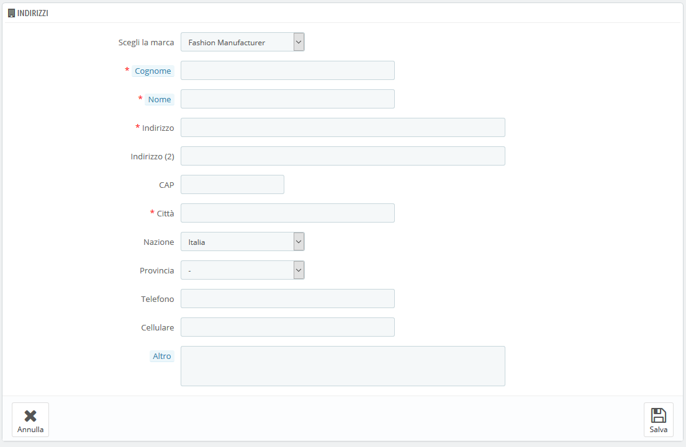

# Gestire i Marchi

A meno che sia tu l’autore dei tuoi prodotti, devi sempre registrare in PrestaShop i marchi dei tuoi prodotti. Nelle precedenti versioni di PrestaShop i marchi venivano chiamati produttori. 

I marchi venivano chiamati produttori nelle versioni precedenti di PrestaShop

Il comportamento di un marchio è esattamente lo stesso del produttore nella versione PrestaShop 1.6: è cambiata solo la denominazione. La scelta è stata fatta per facilitare la navigazione dei clienti nel tuo catalogo, in quanto è più comune cercare un marchio specifico, piuttosto che uno specifico produttore.

Se si desidera utilizzare "brand" è necessario personalizzare le traduzioni del front office.

Se vendi prodotti tuoi, dovrai creare il marchio della tua azienda: ciò aiuterà i clienti a trovare quello che cercano, oltre che rendere il tuo negozio più visibile sui motori di ricerca.

Nel front end del tuo negozio i marchi in ordine alfabetico. Non è possibile modificare questo ordine.

I nuovi marchi vengono disattivati automaticamente. È necessario abilitarli affinché possano essere visualizzate online - anche se non contengono ancora alcun prodotto.

Inserendo informazioni sui marchi, i visitatori del tuo sito possono avere accesso rapido a tutti i prodotti di una determinata marca. Questo rende più facile navigare nel tuo sito. In termini di visibilità, riempire questi campi migliorerà la tua posizione sui motori di ricerca.

## Crea un marchio 

Clicca sul pulsante "Aggiungi nuovo marchio" e si apparirà il form.

Compila tutti i campi:

* **Nome**. Indica il nome del marchio per semplificare la ricerca dei tuoi clienti. 
* **Breve descrizione**. La descrizione che apparirà sui motori di ricerca quando un utente effettuerà una ricerca. Il limite è di 100 caratteri. 
* **Descrizione**. Aggiungi una descrizione più complessa per il marchio, l’attività e i prodotti. Puoi dettagliare le peculiarità e promuovere la qualità dei prodotti. La descrizione del brand verrà mostrata nel tuo negozio insieme alle altre. 
* **Logo**. Avere un logo del marchio è essenziale: aiuta i clienti a fidarsi del tuo negozio così come si fidano di quel brand.
* I campi SEO \(Titolo, Meta descrizione e Parole chiave\) forniscono la stessa funzionalità come nel caso delle categorie. 
  * **Meta titolo**. Il titolo che apparirà nei motori di ricerca quando un cliente effettuerà la ricerca.
  * **Meta descrizione**. Una presentazione del brand di giusto qualche riga per catturare l’interesse del cliente. Apparirà nei risultati di ricerca. 
  * **Parole chiave**. Le parole chiave da definire per farti trovare nei motori di ricerca. Ne puoi inserire diverse, separate dalle virgole, così come i modi di dire e le espressioni devono essere indicati tra virgolette.
* **Attiva**. Puoi disabilitare un brand anche solo temporaneamente. Verrà rimosso dalla lista dei brand nel front end del tuo negozio. 

Salva le modifiche per tornare nell'elenco dei marchi. Da lì, puoi:

* Cliccare sul nome o sul logo di un brand per ottenere l’elenco di tutti i prodotti associati. Se ancora non ci sono, è necessario associare ogni prodotto a tale marchio dalla pagina "Prodotti" nel menu "Catalogo". Lo stesso risultato viene raggiunto cliccando sull'icona "Visualizza" a destra della pagina corrente.
* Disattivare il brand, cliccando sulla spunta verde. Una volta disabilitato, appare una croce rossa al suo posto: clicca per riattivare la marca.
* Visualizzare/modificare /eliminare il brand cliccando sui rispettivi pulsanti a destra della riga.

## Aggiungere un indirizzo del brand 

Nella parte inferiore della pagina "Marchi" è presente una sezione "Indirizzi". Ogni marchio può avere un proprio indirizzo registrato in PrestaShop. Questo serve soprattutto come un promemoria per te: in questo modo, avrai sempre l'indirizzo di contatto del marchio, disponibile direttamente all'interno di PrestaShop.

Clicca sul pulsante "Aggiungi nuovo indirizzo del brand" per aprire il form.

Accertati di scegliere la marca corretta e di riempire il maggior numero possibile di campi.

